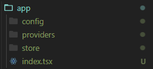
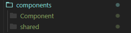

# Структура приложения

## Общая структура


## Папка app

### В папке app у нас лежит файл App.tsx который переименован в index.tsx
### В папке config у нас лежат все конфигурационные файлы (настройки тем и т.д (theme.ts))
### В папке providers у нас лежат все провайдеры и один общий провайдер который "объединяет" все провайдеры через compose (P.S. для compose нужно будет сделать наверное module declare в declaration.d.ts)
#### Провайдер - это HOC. Принимает компонент и возвращает другой - обёрнутый в Provider
##### Например:
```tsx
export const routerProvider = (Component: React.FC) => () => {
  return (
    <BrowserRouter>
      <Component />
    </BrowserRouter>
  )
}
```
### В папке store у нас хранилище приложения (RTK) а в папке reducers все редьюсеры (slice'ы). Возможно что то будет ещё добавляться


## Папка components (возможно тоже будет что-то добавляться)

### Для каждого компонента у нас будет создаваться папка с его названием (Я же просто написал Component)
### В shared будут находится все переиспользуемые компоненты (компоненты для UI.. кнопки, инпуты, т.д)


## Папка routes
### В ней будут находится все роуты приложения (приватные, не приватные...)


## Папка styles
### Там все общие стили, именно css.. не знаю.. надо - не надо


## Папка test
### В папке будут расположены все тесты


## Папка utils
### Просто папка для утилит


## Папка hooks
### По названию, думаю, всё понятно... Там должны лежать все хуки